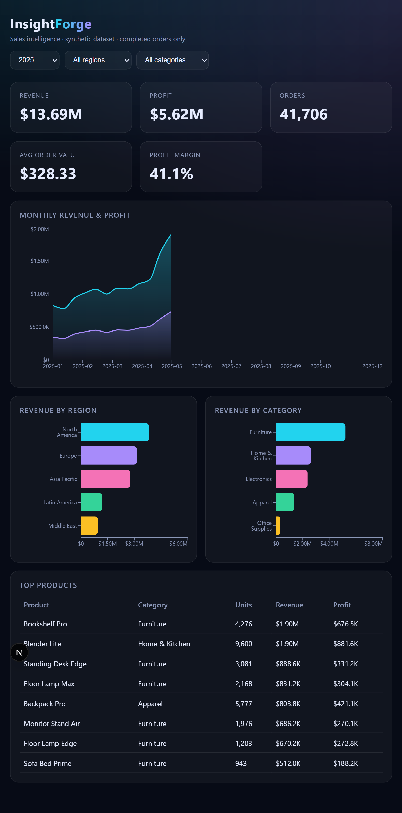
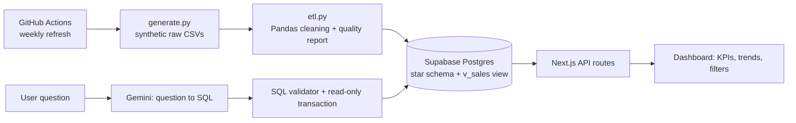

# InsightForge: Sales Analytics Pipeline & AI Dashboard

End-to-end analytics project: **synthetic data → Python ETL → Postgres star schema → Next.js dashboard → natural-language "Ask your data"**.

**Live demo:** insightforge-lemon.vercel.app· **Stack:** Python, Pandas, PostgreSQL (Supabase), Next.js, Recharts, Gemini API, GitHub Actions



## Architecture


## Features
- **Data pipeline:** generates ~121k raw orders with seasonality and deliberate data-quality issues (duplicates, bad discounts, missing regions, messy text), cleans them with Pandas and loads ~119.6k validated rows. A quality report records what was fixed.
- **Star schema:** `dim_customers`, `dim_products`, `fact_orders`, indexes and a `v_sales` reporting view.
- **Dashboard:** animated KPI cards (revenue, profit, orders, AOV, margin), monthly trend, region/category breakdowns, top products, year/region/category filters.
- **Ask your data:** an LLM turns a plain-English question into SQL, which is validated and executed safely, then charted. The generated SQL is always shown.
- **Automation:** a GitHub Actions workflow re-runs the pipeline on a schedule or on demand.

## AI safety design
1. Single `SELECT` only, no semicolons or comments, blocked keywords, only the `v_sales` view allowed.
2. Executed inside `BEGIN READ ONLY` with a 5 s statement timeout and a 200-row cap.
3. Per-IP rate limiting on the endpoint; model fallback and retry on provider overload.

## Run locally
```bash
# 1. pipeline
cd pipeline && python -m venv .venv && .venv\Scripts\activate
pip install -r requirements.txt
python generate.py && python etl.py      # needs DIRECT_URL in pipeline/.env

# 2. dashboard
cd ../web && npm install && npm run dev  # needs DATABASE_URL, GEMINI_API_KEY in web/.env.local
```
Run the SQL in `sql/schema.sql` first to create the tables.

## Notes
All data is **synthetic** (generated with Faker/NumPy); the pipeline and dashboard are the point, not the dataset.